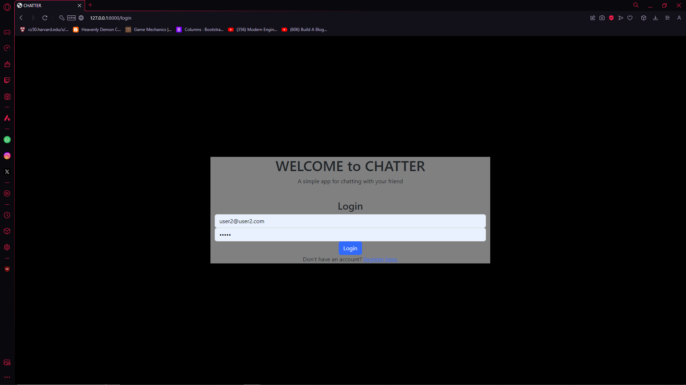

# CS50 WEB PROGRAMMING FINAL PROJECT: CHATTER

The project video is: https://youtu.be/sxh102LQq_0

## Main idea
I'm trying to make a single page application clone of whatsapp to chat between friend. In this app there's the ability for user to chat realtime (with some delay). On this app user can create multiple group for each friend group they have. On this webpage user would be able to :

* Create new group
* Adding new member to the group
* Live Chat on each group

## Distinctiveness and Complexity
The main idea of this project is that i want to make a simple chatting app like Whatsapp that had the capability to chat on realtime, and not only on user to user but also inside a group chat. Base on that i decide to make CHATTER which is a simple clone on whatsapp but with limited capability. 

On this project i decide to use Django as an API by utilizing django REST Framework. And on the frontend i decided to use the same old vanilla javascript. 

On this project i tried to make a chatting app that can provide realtime chatting (or as close as it can be) with friend, at first i try to use websocket to acvieve this but in the end i decide to use fetch api to fetch data to django API each second to achieve this. Tho if the app getting bigger or if there's an increase in app capability i would change it to websocket.

As per requirement, the website should be responsive. To achieve this i use my own CSS and utilize some bootstrap5 library.

This website consist of 3 page which is login page, register page, and the main app page.

Here some of the documentation :
* Login page
<br>
<figure>
    
</figure>
<br>

* Group Chat
<br>
<figure>
    
</figure>
<br>

* Group Chat Small
<br>
<figure>
    
</figure>
<br>

## Files information

* In views.py there is all of the backend code. The main functions are:
    * index : to load the page
    * login_view, logout_view, register : All are reused from previous project to handle login, logout, and register user
    * create_group : API to handle creating group
    * add_member : handling adding member to selected group
    * retrieve_group : to handle request to show all the available group which user are part of
    * retrieve_chat : to handle request to show all the chat inside selected group
    * new_message : handling message from user to database

* Models.py. The different models are:
    * A users model
    * A Group model 
    * A Message model

* Serializers.py. In this app i'm using django REST Framework so this is the serializer for each model :
    * GroupSerializer
    * MessageSerializer

* chat.js: This is the only javascript i have to handle all the process.
    * getCSRFToken() : to easely get the csrftoken for headers in fetch
    * fetchGroup() : to fetch all the group user are part of
    * fetchChat(groupName) : to fetch the chat for selected group
    * newGroup() : handling creating new group
    * sendMessage(groupName) : handling sending message to selected group
    * and the rest of the function are just to help to make the page responsive etc.

* Templates : in this app i only have 4 template (3 of them are reused from previous project which is layout, login and register page. the last one if the main page)
* A css file with all of the css used in the web application. Techniques like flexbox and grid are used
* Other less important files like urls, admin, settings, static images...

## Setup 
> Python and [Git](https://git-scm.com) must be installed on your computer.  
> Creating a virtual environment is optional, but it is usually better to do so if you know how.

Install any required dependencies
```
pip install -r requirements.txt
```  
Initialize the database
```
python manage.py makemigrations
python manage.py migrate
```  
Run the development server
```
python manage.py runserver
```

## Note on academic honesty
If you're taking CS50W, either through [Harvard Extension School](https://extension.harvard.edu/), [Harvard Summer School](https://summer.harvard.edu/) or [OpenCourseWare](https://cs50.harvard.edu/web/), please do not blindly copy paste my code. You are putting yourself at a huge risk for getting excluded from the course by the staff themselves as they grade each project thoroughly. This is a course offered by Harvard, and you will be put up to their standard.